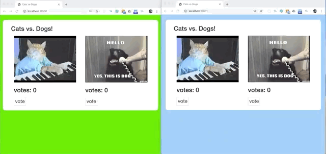

# Production Replay Demo App

## Shadow traffic from one environment to another
 - Clone this repository and run `npm install`
 - Run this app using `node index.js 8000`
 - Run another instance of the app on a different port using `node index.js 8001`
 - Install GoReplay locally by following [these simple Instructions](https://github.com/buger/goreplay/wiki/Getting-Started#installing-gor)
 - Replay traffic from the first instance of the app to the second one using GoReplay: `sudo ./gor --input-raw :8000 --output-http http://localhost:8001`

 
## Record and replay traffic (save to file)
 - Run the demo using `node index.js 8000`
 - Start recording incoming traffic to the demo app by running `sudo ./gor --input-raw :8000 --output-file ./requests_0.gor`
 - Stop the recording by pressing <kbd>Ctrl</kbd>+<kbd>C</kbd>
 - To replay the recording run `sudo ./gor --input-file ./requests_0.gor -output-http http://localhost:8000`
 
## Track responses
- If you wish to include responses in your recoding, run the recording with `--input-raw-track-response` like this: `sudo ./gor --input-raw :8000 --input-raw-track-response --input-raw-realip-header "X-Real-IP" --output-file ./requests_0.gor`
- You can use the recored responses to validate that there are no errors during replay by using a [GoReplay middleware](https://github.com/buger/goreplay/tree/master/middleware)
